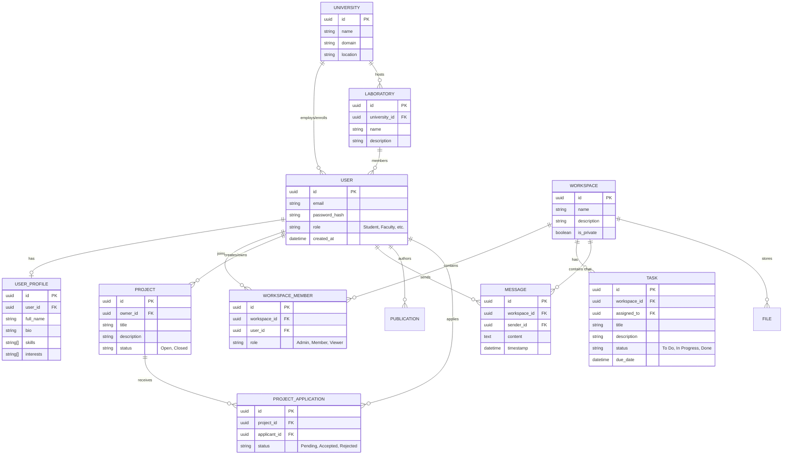

# Entity-Relationship (ER) Diagram
**Project:** ResCollab – Unified Research Discovery & Collaboration Platform

This diagram outlines the core relational database schema for ResCollab. It uses Mermaid.js syntax to define the relationships between entities.

## Design Notes:
1.  **Normalization:** The schema separates core `USER` authentication data from `USER_PROFILE` data.
2.  **RBAC:** User roles are defined at the `USER` level, but also on a per-workspace level (`WORKSPACE_MEMBER`).
3.  **Extensibility:** The `PROJECT` and `WORKSPACE` entities are decoupled to allow a user to have a workspace without an open marketplace project, and vice-versa.
